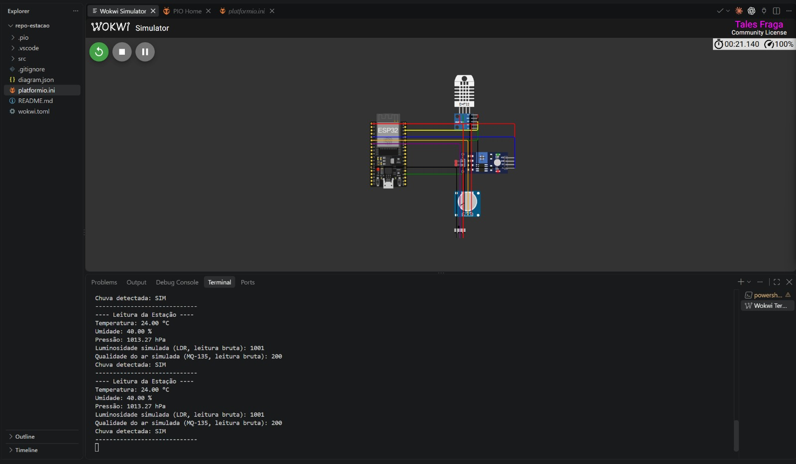

# Entrega S1 — Protótipo virtual da estação meteorológica

## Objetivo da sprint

Validar virtualmente o circuito lógico, o firmware do ESP32 e a leitura periódica das variáveis ambientais antes da aquisição e montagem dos componentes físicos.

## Conteúdo entregue

- Simulação do circuito no Wokwi.
- Firmware em C++ para ESP32, compilado com PlatformIO.
- Leitura contínua de temperatura, umidade, pressão, luminosidade, qualidade do ar e presença de chuva.
- Validação básica de temperatura, umidade e pressão, com identificação de leituras inválidas.
- Saída formatada no monitor serial a cada dois segundos.
- Manual de instalação, execução e testes.
- Diagramas conceituais do circuito e do fluxo do firmware.
- Evidência visual da simulação em funcionamento.

## Correspondência entre simulação e protótipo físico

| Variável | Componente previsto no protótipo físico | Componente usado no Wokwi |
|---|---|---|
| Temperatura e umidade | BME280 | DHT22 |
| Pressão atmosférica | BME280 | BMP180 |
| Luminosidade | Módulo LDR | Módulo LDR |
| Qualidade do ar | MQ-135 | Potenciômetro |
| Presença de chuva | Módulo sensor de chuva | Chave deslizante |

Os componentes substitutos validam o fluxo do programa e a integração das entradas. Eles não representam a precisão, a calibração ou o comportamento elétrico dos sensores físicos.

## Resultado da validação

O projeto foi compilado para a placa `esp32doit-devkit-v1` com sucesso. Durante a execução no Wokwi, foi observado o seguinte ciclo de leitura:

```text
---- Leitura da Estação ----
Temperatura: 24.00 °C
Umidade: 40.00 %
Pressão: 1013.27 hPa
Luminosidade simulada (LDR, leitura bruta): 1001
Qualidade do ar simulada (MQ-135, leitura bruta): 200
Chuva detectada: SIM
-----------------------------
```

As leituras são atualizadas a cada dois segundos. Os controles do Wokwi permitem alterar os valores dos sensores e observar a resposta no terminal.



## Como executar

### Opção recomendada: navegador

1. Abrir [Estação Meteorológica — S1 no Wokwi](https://wokwi.com/projects/474895435837456385).
2. Clicar no botão verde de iniciar a simulação.
3. Aguardar a compilação e acompanhar as leituras no monitor serial.

Essa opção não exige instalação do VS Code, PlatformIO ou extensão do Wokwi.

### Opção local

1. Abrir a pasta `repo-estacao` no VS Code.
2. Instalar as extensões PlatformIO IDE e Wokwi Simulator.
3. Executar o Build do ambiente `esp32doit-devkit-v1` e aguardar `[SUCCESS]`.
4. Executar `Wokwi: Start Simulator` pela paleta de comandos.
5. Acompanhar as leituras no `Wokwi Terminal`.

O passo a passo completo e a solução para terminal vazio no Windows estão em `README.md`.

## Limitações desta entrega

- Não há montagem física nesta sprint.
- Não há calibração nem avaliação de precisão dos sensores reais.
- O potenciômetro fornece apenas um sinal analógico representativo do MQ-135; não mede gases reais.
- A chave representa somente presença ou ausência de chuva; não mede volume em milímetros.
- Wi-Fi, MQTT, API Python, SQLite e dashboard ainda não fazem parte desta versão.

## Próximas etapas

- Adquirir e testar separadamente os sensores físicos.
- Montar o circuito em protoboard e verificar alimentação e níveis de tensão.
- Integrar o BME280, MQ-135, LDR e módulo de chuva reais.
- Implementar Wi-Fi e envio das leituras por MQTT.
- Desenvolver a API, o banco de dados e o dashboard nas sprints posteriores.

## Checklist antes do envio

- [x] Firmware compilado sem erros.
- [x] Simulação iniciada com o circuito completo.
- [x] Seis tipos de leitura exibidos no terminal.
- [x] Evidência visual incluída no repositório.
- [x] Versão online testada e disponível por link.
- [x] Limitações e componentes substitutos documentados.
- [ ] Conferir se existe um modelo obrigatório de apresentação da S1 enviado pelo professor.
- [ ] Revisar os arquivos que serão adicionados ao Git.
- [ ] Fazer commit e push somente após a revisão da equipe.
